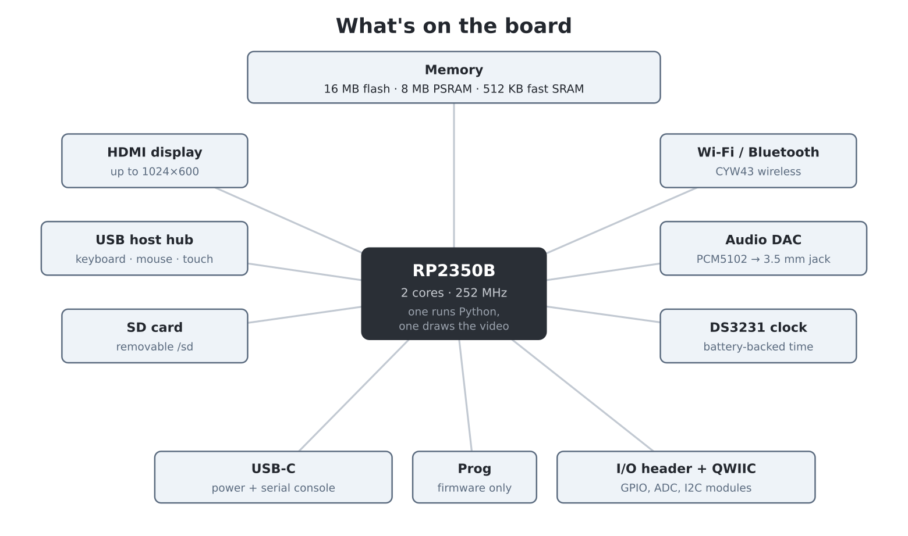

# Chapter 1 — What is the Pico Computer 3?

Switch on the Pico Computer 3 and, a moment later, a prompt appears on the
screen:

```
MicroPython v1.29.0-preview on PICO COMPUTER 3 v0.10 with RP2350B
>>>
```

That `>>>` is an invitation. The machine is waiting for you to tell it what
to do — and the language it speaks is **Python**, the most widely used
programming language in the world.

That makes the Pico Computer 3 a slightly unusual machine, and it is worth
taking a page to explain what it is before we plug anything in.

## A computer that boots straight into a language

Most computers today hide programming away. A laptop starts up into a desktop
full of icons, and writing a program means installing special software, and
the machine does a thousand other things that compete for your attention.

Home computers of the 1980s — machines like the BBC Micro, the ZX Spectrum
and the Commodore 64 — were different. You switched them on and, within a
second, you were *in* the programming language. The machine's whole purpose
was to be programmed, and an entire generation learned to code because the
invitation was right there on the screen.

The Pico Computer 3 revives that idea with modern parts and a modern
language. There is no desktop and nothing to install. You plug in a monitor
and a keyboard, switch on, and you are programming. Everything the machine
can do — draw graphics, play music, read the keyboard and mouse, browse its
files, connect to Wi-Fi — you do by typing commands, and anything you can
type as a command you can put in a program.

> **Coming from MMBasic:** this will feel familiar — the Pico Computer 3 is
> a close cousin of the PicoMite, and much of its firmware is ported
> directly from PicoMite MMBasic. The difference is the language: Python
> instead of BASIC. Throughout this book, boxes like this one translate
> MMBasic ideas into their Python equivalents.

## A tour of the hardware

Under the hood, the Pico Computer 3 is built around the **RP2350B**, a chip
designed by Raspberry Pi. Here is what you are getting, in plain terms:



**The brain.** The RP2350B has *two* processor cores running at 252 MHz
(they can be pushed to 378 MHz — chapter 15). One core runs your Python
programs; the other is dedicated full-time to generating the video picture,
which is why graphics feel effortless. By the standards of the machines that
inspired this one, it is a monster: thousands of times faster than a BBC
Micro, with tens of thousands of times more memory.

**Memory.** Three kinds, and the distinction will matter later:

- **16 MB of flash** — permanent storage. 12 MB of it is a filing system
  where your programs and files live. Nothing here is lost when the power
  goes off.
- **8 MB of PSRAM** — the workspace where your running program keeps its
  variables, images and sounds. Cleared at power-off.
- **512 KB of fast SRAM** — used by the system itself, mostly to hold the
  screen image.

**The display.** A standard HDMI socket drives any HDMI monitor or TV. The
machine starts up at 640 × 480 in 256 colours, and can go as high as
1024 × 600. The video signal is generated by the chip itself — there is no
separate graphics card.

**The keyboard, mouse and touch.** The board has its own built-in USB hub
(a CH334U) supporting up to four devices at once, so a normal USB keyboard,
a mouse and even a touch screen all plug straight in. These are *host*
sockets: they are where you plug devices in, not a way to connect the Pico
Computer to a PC — the board is the computer now, not an accessory.

**Two more ports.** A **USB-C** socket supplies the board's power (through
a push-on/push-off switch) and doubles as the *serial console* — a second
copy of the Python prompt that a PC can connect to; you will use it to send
files to the machine and as a lifeline if the screen is ever misconfigured.
A **micro-USB** socket labelled **Prog** is used only for installing
firmware. Both are explained in chapter 2.

**Storage you can carry.** An SD card slot, mounted as `/sd`. Cards can be
swapped while the machine is running, and because they are standard FAT
cards you can also fill them from a PC — handy for images and music.

**Sound.** A proper audio DAC (a PCM5102) feeds a standard 3.5 mm stereo
jack — plug in headphones or powered speakers. The firmware can play WAV,
MP3 and FLAC files, generate tones, run a four-voice synthesiser, and play
classic `.mod` tracker music — chapter 20.

**A clock that keeps time.** A battery-backed DS3231 real-time clock keeps
the date and time even when the machine is unplugged, so your programs
always know what day it is.

**Wi-Fi and Bluetooth.** A CYW43 wireless chip connects the machine to your
network and the internet — chapter 30. (A small status LED also lives on
this chip; you will blink it in the next chapter.)

**Room to grow.** Like its Raspberry Pi Pico relatives, the board can
control electronics you add yourself. An I/O header exposes over twenty
general-purpose input/output (GPIO) pins plus power, for LEDs, buttons,
sensors and motors you wire up; and a **QWIIC** socket accepts the huge
family of plug-together I2C modules (SparkFun Qwiic, Adafruit STEMMA QT,
Pimoroni Qw/ST) with no soldering at all — chapter 32.

{width=100%}

## What is a program?

A computer, for all its speed, does nothing on its own. A **program** is a
list of instructions, written out in advance, that the computer follows
exactly and very, very fast. Programming is the craft of writing those
instructions — and the fun of it is that a correct list of instructions can
do apparently magical things: draw a spiral, run a game of Breakout, fetch
the weather from the internet.

The catch is that the computer follows your instructions *exactly*,
including the wrong ones. It has no idea what you meant — only what you
typed. Learning to program is partly learning a language, and mostly
learning to think precisely enough to say what you mean. This book teaches
both, in small steps, with something to show on screen at every step.

## Why Python?

The instructions have to be written in a language the machine understands.
This machine speaks **Python**, and it is hard to imagine a better first
language:

- It reads almost like English. `if lives == 0: print("Game over")` means
  exactly what it looks like it means.
- It is *interactive*. You can type one instruction and see the result
  instantly, which is how this whole book works.
- It is real. The Python you learn here is the same language used
  professionally for science, artificial intelligence, web services and
  more. Nothing you learn on this machine is a toy skill.

Strictly, the machine runs **MicroPython** — a lean, real implementation
of Python built for small computers. It *is* Python: the language, the
way of thinking, and almost every program in this book would run
unchanged on a desktop. But it is not quite *desktop* Python — it trims a
few corners to fit a machine this size, and those differences, though
small, can catch you out if you assume they aren't there. This book
points them out as they arise.

The Pico Computer 3 also **adds** things that plain MicroPython has no
notion of: friendly one-word commands like `run`, `edit` and `ls`, the
file manager, and the graphics, sound and input helpers that make this a
*computer* and not just a chip. These are genuine conveniences — but they
live on *this* machine, not in MicroPython everywhere. So whenever a
feature is one of these home comforts, the book flags it **Pico Computer
3 specific** and, where it helps, shows the standard MicroPython way
beside it. That way you always know which skills travel to other boards
and which stay here.

> **Coming from MMBasic:** Python's biggest culture shock is that *layout
> matters* — where BASIC marks a block with `FOR…NEXT` or `IF…ENDIF`,
> Python marks it by indenting the lines inside. You will meet this
> properly in chapter 7, and the full translation table is appendix B.

## How to use this book

The book is a course, not a reference manual — chapters build on each other,
and each one is built around something you *make*. Part I (you are in it)
gets the machine running and teaches you to drive it. Part II teaches the
Python language itself, using the screen so every idea is visible. Part III
covers graphics, sound and input; Part IV builds four complete games;
Part V builds real applications, from GUI programs to internet-connected
gadgets; Part VI looks under the hood.

Three habits will serve you well from the start:

1. **Type the examples.** Typing, making mistakes and fixing them is where
   the learning happens. Copy-paste teaches nothing.
2. **Do the Experiments** at the end of each chapter — they are small tweaks
   to what you just built, and each one cements an idea.
3. **Break things.** You cannot damage this machine by typing the wrong
   thing. The worst that happens is an error message or, rarely, a frozen
   program — and chapter 2 shows you how to recover from both.

When you eventually need the fine detail of some command, that lives in the
*Pico Computer 3 User Manual* — the machine's reference document. This book
points there whenever you are ready for more.

## Experiments

1. Find each connector on your board: HDMI, the keyboard/mouse USB sockets,
   the USB-C console port, the micro-USB *Prog* port (and its *USB HUB*
   switch), the SD slot, audio and power. Which ones will you use every
   day, and which just occasionally?
2. If you used a home computer of the 1980s (or MMBasic today): what is one
   thing you could do the moment it switched on that a modern laptop makes
   you work for?

## Challenges

1. The RP2350B runs at 252 MHz; a BBC Micro ran at 2 MHz. Estimate how many
   instructions per second each performs, and how long the Pico Computer 3
   takes to do what took the BBC Micro a full second. (Hint in appendix F.)
