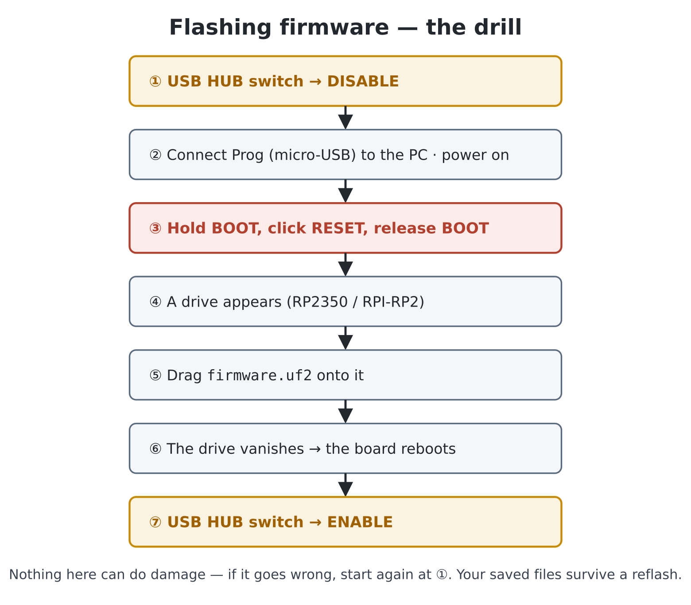

# Chapter 2 — Getting started: flashing and first boot

In this chapter you will put the firmware onto the board, wire everything
up, and prove the machine is alive by making it speak, beep and blink. By
the end you will be sitting at a working Python computer.

## What you will need

- The Pico Computer 3 board.
- An HDMI monitor or TV, and an HDMI cable.
- A USB keyboard. (A basic wired one is the safe choice; the board's
  built-in USB hub takes up to four devices, so a mouse can join it later.)
- A **USB-C power supply rated at 2 A** — a decent phone charger. Why 2 A:
  the board's USB hub will pass up to 2 A on to whatever you plug into it.
  The same USB-C socket also carries the *serial console*, so a PC can
  power the board instead of a charger — useful later for sending files
  across and as a recovery lifeline — provided its USB port can supply 2 A.
- Optional: headphones or powered speakers for the 3.5 mm audio jack —
  without them, `beep()` in step 4 will be a silent experience.
- **For the one-time firmware install:** a PC or laptop and a **micro-USB
  data cable** for the board's *Prog* port.
- Optional: a micro-SD card (FAT-formatted, as most come) and a **CR2032**
  coin cell so the clock keeps time while the power is off.

While the box is open, find three things on the board you will need in a
moment (they are all visible in chapter 1's photograph): the **micro-USB
socket labelled "Prog"**, the small slide switch labelled **"USB HUB"**
(positions *ENABLE* / *DISABLE*), and the two push-buttons labelled
**BOOT** and **RESET**.

## Step 1 — Get the firmware

The firmware is a single file called `firmware.uf2`. Download the latest
release to your PC from:

> **https://github.com/UKTailwind/micropython/releases/latest**

If your board came with the firmware pre-installed, skip straight to
*Step 3 — Wire up and switch on*; you can always come back here when an
update is released.

## Step 2 — Flash the firmware

The RP2350 chip has a built-in "accept new firmware" mode in which it
pretends to be a USB memory stick. Getting into it involves the *Prog*
port, the *USB HUB* switch and the two push-buttons:

1. Slide the **USB HUB** switch to **DISABLE**. (This hands the chip's USB
   connection to the Prog port; in *ENABLE* it belongs to the keyboard
   sockets instead, and the PC would see nothing.)
2. Connect the **Prog** micro-USB socket to your PC with the data cable.
   Power still arrives through the USB-C socket as usual, so connect that
   too and switch the board on.
3. **Hold down BOOT**, click **RESET**, then release **BOOT**.
4. A new drive appears on the PC (named `RP2350` or `RPI-RP2`), just as if
   you had plugged in a memory stick.
5. Drag `firmware.uf2` onto that drive.
6. Wait a few seconds. The drive vanishes by itself — that is the board
   saying "got it" and rebooting into the new firmware.
7. Unplug the Prog cable and slide the **USB HUB** switch back to
   **ENABLE** — the keyboard sockets don't work without this, so make it a
   reflex: *flash done, switch back*.

That's it. Nothing to install on the PC, and you cannot get it wrong in any
damaging way — if anything goes amiss, start again at step 1. The same
procedure installs every future firmware update, and updating the firmware
does **not** erase the programs you have saved on the board.



One thing that surprises PC users: in normal operation the Pico Computer 3
will *not* show up as a drive on a PC. With the switch at *ENABLE*, the
chip's USB connection belongs to your keyboard and mouse — the board is the
computer now, not an accessory. The Prog port exists purely for firmware.

> **Coming from MMBasic:** the same BOOT-and-RESET, drag-a-UF2 drill as
> flashing a PicoMite — plus this board's *USB HUB* switch, which must be
> at *DISABLE* to flash and back at *ENABLE* afterwards.

## Step 3 — Wire up and switch on

1. Check the **USB HUB** switch is at **ENABLE**.
2. Connect the HDMI cable to the monitor, and switch the monitor on.
3. Plug the keyboard into one of the board's USB sockets.
4. Plug headphones or speakers into the 3.5 mm jack, if you have them.
5. Slide in the SD card, if you have one.
6. Connect the power supply to the **USB-C** socket and press the **power
   switch** (push on / push off).

Within a couple of seconds the monitor lights up and shows the banner:

```
MicroPython v1.29.0-preview on PICO COMPUTER 3 v0.10 with RP2350B
>>>
```

You will also see a line like `USB keyboard -> slot 1` confirming the
keyboard was found. The `>>>` is the **prompt** — the machine's way of
saying "your turn".

## Step 4 — Prove it's alive

Type each line below at the prompt and press **Enter** after it. (Typing,
remember, not pasting — get your fingers used to the machine.)

Ask it to speak:

```python
>>> print("I am alive!")
I am alive!
```

Ask it a question — the prompt is a calculator whenever you need one:

```python
>>> 6 * 7
42
```

Make a noise:

```python
>>> beep()
```

And blink the status LED on and off:

```python
>>> led = Pin("LED", Pin.OUT)
>>> led.on()
>>> led.off()
```

Four lines in, you have used the four things every program is made of:
output, calculation, sound and control of hardware. Everything from here to
the Asteroids game in chapter 24 is these ingredients, arranged with more
care.

Don't worry about *why* these lines look the way they do — that is what the
next chapters are for. Do notice what happens if you mistype one:

```python
>>> beeep()
Traceback (most recent call last):
  File "<stdin>", line 1, in <module>
NameError: name 'beeep' isn't defined
```

Nothing bad. The machine tells you it didn't understand, names the word it
choked on, and gives you a fresh prompt. Error messages are the machine
helping, not scolding — chapter 3 teaches you to read them.

## Step 5 — Tell it about your keyboard

The machine assumes a **US** keyboard layout. If `"` and `@` come out
swapped, or `#` is missing, set your layout:

```python
>>> keymap("UK")
```

Available layouts are US, UK, DE, FR, ES and BE (`keymaps()` lists them).
The setting is remembered across power-offs, so this is a one-time job.

This is your first meeting with a pleasant habit of the machine: settings
worth keeping (keyboard layout, screen mode) are saved automatically and
restored at every boot.

> **Coming from MMBasic:** `keymap("UK")` is `OPTION KEYBOARD UK`. The
> saved-settings idea matches MMBasic's `OPTION` system generally.

## If something doesn't work

| Symptom | Likely cause and fix |
|---|---|
| Monitor shows nothing at power-on | Is the power switch actually on? (It's push-on/push-off, so a second press turns the board *off*.) Then check the HDMI cable is seated and the monitor input source is right. Monitors take a couple of seconds to lock onto a new signal — be patient before re-plugging. |
| Monitor says "no signal" or "mode not supported" | A previously saved screen mode may not suit this monitor. Connect via the USB-C console (see below) and type `screen(hdmi.RGB640)`. |
| Keyboard does nothing | First check the **USB HUB** switch is at **ENABLE** — at *DISABLE* the keyboard sockets are dead. Then look for the `USB keyboard -> slot 1` message at boot. Wireless keyboards with their own dongle usually work; Bluetooth-only ones do not. |
| Wrong characters when typing (`"` vs `@`) | Set your layout: `keymap("UK")` — step 5. |
| The board never appears as a drive when flashing | The **USB HUB** switch must be at **DISABLE**; hold **BOOT** *while* clicking **RESET**; and use a micro-USB *data* cable — some charging cables have no data wires. |
| A program is stuck and the prompt won't come back | Press **Ctrl-C**. This interrupts whatever is running and returns you to `>>>`. Failing that, click **RESET** — the machine boots fresh in seconds and your saved files are untouched. |
| `led.on()` works but no light appears | Check the small 3-pin jumper labelled **HEARTBEAT** sits on its **CYW43** side — that is where `Pin("LED")` drives LED1 on a standard (Wi-Fi-equipped) board. |
| Settings are in a mess and you want a fresh start | `rm("/settings.json")` then power-cycle: US keyboard, 640×480 defaults are restored. Your own files are not affected. |

**The USB-C port — a lifeline worth knowing about.** Alongside the screen
and keyboard, the machine carries a second copy of the console on its
**USB-C** port — the same one that supplies its power. Connect it to a PC
instead of the charger, open a terminal program (PuTTY or TeraTerm on
Windows, `screen` on Linux/Mac) at **115200 baud**, and the same `>>>`
prompt appears there — whatever state the screen is in. You will
not need it in normal use, and nothing in this book requires it — but if
the display is ever unusable (say, a saved video mode your monitor
rejects), one command typed over USB-C fixes it. It is also how files are
sent from a PC without an SD card (chapter 5). Details are in the User
Manual, section 1.

## Experiments

1. Change the beep: try `beep(1000)` and `beep(200)`. Which number do you
   suppose is the pitch? (Guessing and testing is a legitimate research
   method — you will use it constantly.)
2. Make the LED blink slowly by alternating `led.on()` and `led.off()`.
   Tedious, isn't it? In chapter 8 you will teach the machine to do the
   repeating for you.
3. Switch the machine off mid-sentence, switch it back on, and confirm your
   keymap setting survived but your `led` variable did not (`led.on()` now
   gives a `NameError`). Flash remembers; workspace forgets — that
   distinction from chapter 1, seen live.

## Challenges

1. Use the prompt-as-calculator to work out how many seconds you have been
   alive. Roughly — no clock-watching required.
2. Explore `help()`. It mentions things this book hasn't — skim it now,
   recognise it later.
