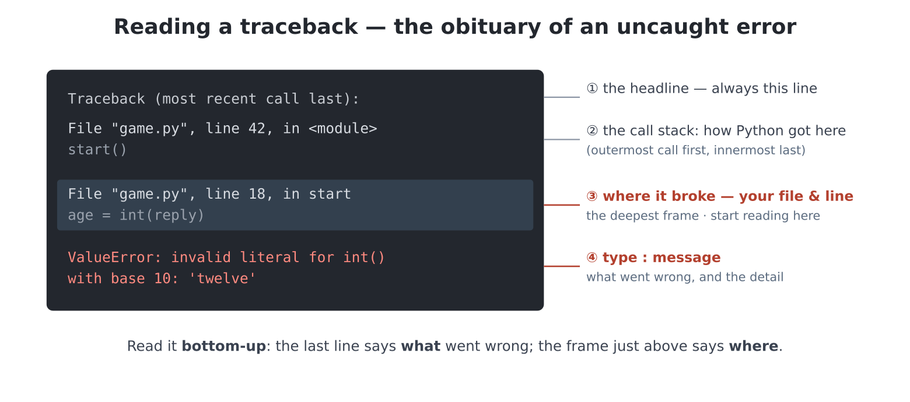

# Chapter 13 — When things go wrong: errors and debugging

You have been reading error reports since chapter 3 and borrowing
`try`/`except` since chapter 12, always with an IOU attached. This
chapter pays every debt — and it teaches the half of programming that
nobody's brochure mentions: real programming is mostly *dealing with
wrongness*, and the people you would call brilliant programmers are,
almost without exception, merely calm and systematic about it.

Start by splitting "wrong" in two, because the halves need different
tools:

- **Exceptional situations.** The program is fine; the *world*
  misbehaved — the file isn't there, the SD card was pulled, the human
  typed `twelve`. These you **handle**, with `try`/`except`.
- **Bugs.** The world is fine; the *program* is wrong — it runs, and
  the answer is nonsense. These you **hunt**, with craft.

## What an exception actually is

When something impossible is asked of it — `int("twelve")`, `1/0`,
opening a file that isn't there — Python does not limp on with a wrong
answer. It stops on the spot and **raises an exception**: an alarm that
travels up out of function after function until *something catches it*
— and if nothing does, it reaches the surface as the traceback you have
been reading all book. That is all a traceback is: the obituary of an
uncaught exception.

You already know how to read one (deepest line naming your file; last
line names the type). What is new today: the alarm can be *caught*.



## `try`: the safety net

The classic wound, open since chapter 6 — any program with
`int(input(...))` dies instantly if a human types like a human:

```python
>>> age = int(input("How old are you? "))
How old are you? twelve
Traceback (most recent call last):
  File "<stdin>", line 1, in <module>
ValueError: invalid syntax for integer with base 10: 'twelve'
```

Here is the net:

```python
while True:
    reply = input("How old are you? ").strip()
    try:
        age = int(reply)
        break
    except ValueError:
        print(f"'{reply}' isn't a number I know. Digits, please!")
```

Read the flow carefully, because it *is* the feature. Python runs the
`try` block line by line. If nothing goes wrong, the `except` block is
skipped entirely (the `break` escapes the loop). But the moment
anything in the `try` raises a `ValueError`, execution *jumps* to the
`except` block — no traceback, no death — and the program carries on
after it; here, the `while True` offers the human another go. Type
`twelve`, get a polite retort, type `12`, play on.

This is so useful it should live in your toolbox forever. `edit`
a new library, `handy.py`:

```python
# handy.py -- input that survives humans.

def ask_int(prompt):
    """Ask until the reply is a whole number; return it."""
    while True:
        reply = input(prompt).strip()
        try:
            return int(reply)
        except ValueError:
            print(f"'{reply}' isn't a whole number -- try again.")
```

Every `int(input(...))` in every program you have written — the dojo,
the guessing game, the converter — can now be `handy.ask_int(...)`, and
that whole class of crash is extinct on your machine.

> **Coming from MMBasic:** `try`/`except` is `ON ERROR SKIP`/`ON ERROR
> IGNORE` grown up — instead of muffling whatever the next line does,
> you declare exactly *which* trouble you expect, over exactly *which*
> lines, and what to do instead. `MM.ERRNO`-style detail is the
> `as e` form, two sections down.

## Catch precisely

An `except` names the exception it is prepared to handle, and this is a
point of professional honour: **catch what you expect, let the rest
crash.** You could write a bare `except:` that catches *anything* — and
you will regret it, twice. Once because it swallows your own bugs (a
typo inside the `try` now silently "handles" its own `NameError`, and
you stare at a program that does nothing wrong and nothing at all).
And once because it even swallows **Ctrl-C** — a bare `except:` around
a loop makes a program you *cannot interrupt*. The stuck-program lesson
of chapter 5 suddenly has a monster in it; do not build the monster.

Name one, name several, or stack them:

```python
try:
    points, name = line.strip().split(",")
    scores.append((int(points), name))
except ValueError:
    print("skipping a malformed line")
except OSError:
    print("file trouble -- is the SD card in?")
```

And now chapter 12's borrowed incantation can be read in full.
`scorelib.load` wrapped its file-reading in `try:` ... `except
OSError: pass` — meaning: *the one failure I consider normal here is
the file not existing (first ever run), and my handling is: start with
an empty list.* `pass` is Python for "do nothing, on purpose". One
line of philosophy: an exception handler is a **decision about what
failure means**, made in advance, by you.

## Hearing what happened: `as e`

The exception carries its message; `as` catches the object so you can
use it:

```python
try:
    with open(path) as f:
        data = f.read()
except OSError as e:
    print(f"Couldn't read {path}: {e}")
```

Your report is now specific ("Couldn't read /sd/data.txt: [Errno 2]
ENOENT") without being fatal. Kinder than a traceback, more honest
than silence.

## `raise`: sounding the alarm yourself

Exceptions are not the interpreter's private privilege. When *your*
function is handed nonsense, the right move is usually not to soldier
on but to raise:

```python
def polygon(t, sides, size=60):
    if sides < 3:
        raise ValueError(f"a polygon needs 3+ sides, got {sides}")
    for _ in range(sides):
        t.forward(size)
        t.right(360 / sides)
```

Consider what happens *without* the guard. `polygon(t, 0)`? The loop
runs zero times — the function silently draws **nothing**, no alarm at
all, and twenty minutes later you are debugging an empty screen.
`polygon(t, 2)`? The turtle walks out and straight back — an invisible
smear. Nonsense in, silence out: the worst kind of wrong, because
nothing points at it. The guard converts silent nonsense into an
immediate, plain-language report at the exact call that caused it.
Every mysterious misbehaviour a library ever showed you was somebody
choosing *not* to write this guard; every clear error, somebody who
did. (This is also the moment `raise ValueError` stops being magic
words: exceptions are made things, raised by code, catchable by name.)

## The rogues' gallery

Every error type you have met, and the usual culprit — the chapter's
reference table, worth a corner of your desk:

| Alarm | Usual cause | First move |
|---|---|---|
| `SyntaxError` | missing `:` or bracket; `=` where `==` belongs | look *at and before* the pointed line |
| `IndentationError` | wrong indent; tabs/spaces mixed | re-indent with Tab/Shift-Tab |
| `NameError` | typo, wrong Capitals, or used before created | read the name in the message *letter by letter* |
| `TypeError` | mixing kinds — usually a forgotten `int(input(...))` | trace where the value was born |
| `ValueError` | right kind, impossible value — `int("twelve")` | validate, or catch and retry |
| `IndexError` | position ≥ `len` — off-by-one, or empty list | print the list and the index first |
| `KeyError` | dictionary key absent — often a typo'd key | print the dict's keys; check with `in` |
| `OSError` | file/SD trouble — wrong path, missing file, card out | `ls()` the folder; check the mode |
| `AttributeError` | right dot, wrong thing — `"text".append(...)` | check what the variable *actually* holds |
| `KeyboardInterrupt` | you pressed Ctrl-C | that one's yours |

The pattern across the whole table: the message *names the culprit* —
a name, a key, a type, a path. The cure starts with believing it.

## Hunting bugs: the other half

No alarm, wrong answer — the program is lying to you politely. Here is
a real hunt, start to finish. The suspect:

```python
def average(numbers):
    total = 0
    for i in range(1, len(numbers)):
        total += numbers[i]
    return total / len(numbers)

print(average([80, 90, 100]))
```

It prints `63.333...` — no crash, but you know three students who
average 90. The method, step by step:

**1. Reproduce it small.** Three numbers already does it. (A bug you
can summon on demand is half-caught; a bug in a 300-line game gets
*extracted* into a five-line summons like this one.)

**2. Interrogate the state.** `print` is the debugger you always have.
Put one *inside* the loop:

```python
    for i in range(1, len(numbers)):
        print("visiting position", i, "value", numbers[i])
        total += numbers[i]
```

Run: `visiting position 1 value 90`, `visiting position 2 value 100` —
and there it is, confessing: *position 0 was never visited.* The 80
never joined the total: 190 ÷ 3.

**3. Fix the cause, not the symptom.** The lazy patch (add 80!?) dies
with the next list. The cause: `range(1, ...)` — someone thought
positions start at 1. Chapter 10 knew better; make it `range(len(numbers))`.
Better still, remove the habitat: positions were never needed —

```python
    for n in numbers:
        total += n
```

The idiomatic loop has no room for the off-by-one to live in. That is
a general truth worth framing: **the simpler form isn't just prettier;
it has fewer places for bugs to hide.**

**4. Retest — including what already worked.** Then take the prints
out. (`Ctrl-P` comments them in a keystroke if you'd rather keep them
handy.)

Two more habits complete the kit. **Change one thing at a time** —
alter two and the retest tells you nothing. And when truly stuck,
**explain the code aloud, line by line, to anything with a face** —
the bug is usually heard on the way out of your own mouth.
Programmers call it rubber-ducking; it is embarrassing exactly once.

## Project: the bulletproofing pass

Take three programs you own and make them survivor-grade — the errors
of the *world* handled, the habits of chapter 13 applied:

1. **The diary** (chapter 12): reading before any entry exists
   currently dies of `OSError`. Catch it in `read_diary` and print
   `"(the diary is empty -- write something!)"` instead.
2. **`scorelib`**: experiment 4 scarred it — one malformed line kills
   `load`. Move a `try`/`except ValueError` *inside* the loop so a bad
   line is *skipped*, counted, and reported (`"warning: skipped 1 bad
   line"`) while the good lines survive. Decide — deliberately, in a
   comment — why skipping beats crashing here (or argue the reverse:
   a corrupted score file might deserve a loud death; the point is
   that *you* now make that call).
3. **Any game with a number prompt**: swap its raw `int(input(...))`
   for `handy.ask_int(...)`, and try to type it to death.

Test each the honest way: *be* the hostile world. Missing files, empty
files, `twelve`, a pulled SD card, Enter mashed on its own. When you
cannot crash your own program, promote it.

## What you now hold

- **Two wrongnesses, two tools**: the world's failures are *handled*
  (`try`/`except`), the program's failures are *hunted* (the method).
- **The flow**: `try` runs until trouble; the named `except` catches
  it; life continues after the block. Retry loops come from wrapping
  the pair in `while True`.
- **Catch precisely** — name the exception; bare `except:` swallows
  bugs and Ctrl-C alike. `as e` keeps the details for your report.
- **`raise ValueError("...")`** guards your own functions — clear
  errors are a courtesy the author of a library pays the caller.
- **The hunt**: reproduce small → print the state → fix the cause →
  retest everything → one change at a time — and prefer the code shape
  with nowhere for bugs to live.

## Experiments

1. Error bingo: using the rogues' gallery, deliberately cause all nine
   catchable alarms in one throwaway file (one line each, run,
   comment out with Ctrl-P, next). Nine tracebacks read on *your*
   terms — cheap immunisation.
2. Make `ask_int` fussier: an optional `low` and `high` (chapter 11
   defaults), re-asking outside the range. The dojo and the guessing
   game both want this immediately.
3. Feel the bare-except monster *safely*: `while True:` /
   `try: input("> ")` / `except: pass` — run it, try Ctrl-C, fail,
   and press RESET (chapter 2's escape hatch, files unharmed). Now
   rewrite it with `except ValueError:` and watch Ctrl-C work again.
   Ten minutes, lifelong conviction.
4. Add the `sides < 3` guard to your real `shapes.py`. First, though,
   run the *unguarded* `polygon(t, 0)` and `polygon(t, 2)` and watch
   exactly nothing tell you anything is wrong. Then add the guard and
   run them again. Which version would you rather be using at line 400
   of a game?
5. Re-run chapter 12's corrupted-CSV experiment against bulletproofed
   `scorelib`. Savour it.

## Challenges

1. **The unbreakable calculator.** Two numbers and an operator
   (`+ - * /`), any input survivable: `twelve`, an unknown operator,
   dividing by zero — each with its own message, all in a re-asking
   loop. Bonus: `q` quits (which input? both? all three? design it).
2. **The validator.** A checker for `cards.txt` (chapter 12's
   flashcards): reads every line, reports each problem *with its line
   number* (`"line 7: no comma"`), and ends `"3 problems"` or `"all 40
   cards ok"`. This is a real tool — data files rot, and validators
   are how grown-up software notices.
3. **Crash diary.** For one week, when a program of yours dies, append
   the date, the error type and the one-line cause to `/bugs.txt`
   (chapter 12 knows how) before fixing it. Read it on day seven:
   *your* personal rogues' gallery, which is the one that matters.
4. **The tutor.** A program that *demands* a wrong answer: it asks for
   a number, and for each different way the reply can be wrong (not a
   number, too big, negative...) prints which alarm *would* have been
   raised and why — a quiz where the subject is this chapter.
