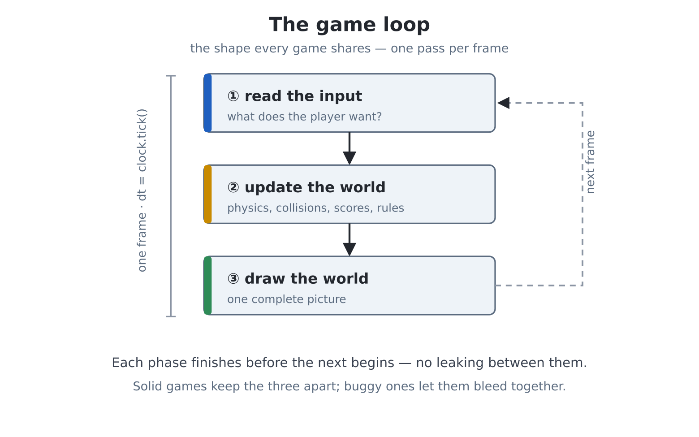

# Chapter 22 — Anatomy of a game

Welcome to Part IV. You can draw at sixty frames a second, keep score
in files, make lasers, and read a keyboard six keys at a time — every
part of a game except the game. This chapter supplies the missing
organ: the shape that every game shares, from Pong to the newest thing
on any console in your house. Learn the shape once and every game you
ever write — including the three that follow in this Part — is a
variation on it.

The chapter in advance, because this is one of the big ones:

- **The game loop** — read input, update the world, draw — and why
  the order matters.
- **Frame timing** — `pcgame.Clock`, `dt`, and why speed must be
  measured in *per second*, never *per frame*.
- **Game state** — title, playing, game over: one variable, one
  ladder, a whole architecture.
- Project: **Pong**, built from nothing, playable by two humans, in
  two sittings.

## The loop

Strip any game to the skeleton and this is what remains:

```
forever:
    read the input        (what does the player want?)
    update the world      (physics, collisions, scores, rules)
    draw the world        (one complete picture)
```

You have written this three times without the ceremony — the gallery,
the island, paint. The discipline the ceremony adds: **each phase
completes before the next begins.** Input is read once, at the top —
not sampled mid-physics, where a key change could act on half the
update. The world updates entirely — every ball, every paddle, every
rule — before a single pixel is drawn. And drawing renders *the*
world, never nudging it. Games with mysterious bugs are usually games
where these phases leak into each other; games that feel solid are
games where they don't.

*In one line: input, then update, then draw — one complete pass per
frame, no leaking between phases.*



## Frame timing: the metronome

Chapter 17's `vsync` paced your loops at sixty a second — as long as
your frame's work fit. But game frames vary: an explosion here, six
extra sprites there, and a heavy frame arrives *late*. Two things then
go wrong: motion measured per-frame slows down (the ball crawls
exactly when the action peaks), and naive timing drifts — every late
frame pushes all the following ones later, forever.

`pcgame.Clock` is the cure for both, and the machine's version has
MMBasic pedigree (`SYNC`):

```python
import pcgame

clock = pcgame.Clock(60)          # target: 60 beats per second
while True:
    # wait for the beat; dt = seconds elapsed
    dt = clock.tick()
    x += speed * dt               # speed is now PER SECOND
```

Two ideas in three lines. First, **the drift-free beat**: `tick()`
waits until the next *scheduled* deadline — anchored to the clock, not
to when the last frame happened to finish — so one slow frame steals
from itself, not from the future; the cadence self-heals.
(`clock.fps` reports the achieved rate, ready for a corner of your
HUD, and `clock.reset()` re-anchors after a pause menu, so the game
doesn't try to "catch up" on frames it missed while paused.)

Second — the habit that separates games that feel right from games
that don't — **`dt`**. `tick()` returns the seconds actually elapsed
(about 0.0167 at sixty). Multiply every speed by it, and speeds
become *per second*: a paddle moving `300 * dt` covers 300 pixels each
second whether frames come at sixty, fifty, or unevenly. Motion is
promised to the *player's clock*, not the processor's mood. Every
velocity in this Part is written per-second; do the same and your
games survive their own success.

One more gift: `pcgame.Clock(vsync=True)` anchors the beat to the
display's own refresh instead of a timer — each `tick()` returns just
as a frame ends, which is exactly the moment to flip chapter 17's F
buffer. That combination — tick, update, compose, copy — is the
display loop Pong uses below, and the games after it.

*In one line: `dt = clock.tick()` paces the loop without drift; all
speeds are per-second, multiplied by `dt`.*

## Game state: one variable, whole architecture

A game is not always *playing*. There is a title screen, perhaps a
pause, a game-over; each reads input differently, updates differently,
draws differently. The beginner's instinct — separate loops for each —
tangles instantly. The games answer is older and simpler: **one loop,
one `state` variable, one ladder**:

```
forever:
    tick
    if state == "title":    ...space starts the game...
    elif state == "play":   ...the actual game...
    elif state == "over":   ...show the winner, offer again...
    draw whatever the state calls for
```

Changing screens is now an assignment: `state = "over"`. The loop, the
clock and the display machinery never notice. You met the idea as
chapter 7's ladder and chapter 14 would happily object-ify it; for the
games in this book, a string and a ladder are exactly enough.

*In one line: one loop runs everything; a `state` string picks what
input/update/draw mean this frame.*


## Project: Pong, part one — the rally

Two evenings, two listings. Tonight: a court, a ball with real
timing, two paddles, and the deflection physics that made Pong
*Pong*. No scoring yet — a rally sandbox for two players (W/S on the
left, arrows on the right). `edit("pong1.py")`:

```python
import pcgame
import keyboard
import time

def held(code):
    for i in range(1, keydown(0) + 1):
        if keydown(i) == code:
            return True
    return False

# this game is laid out for 640x480
screen(hdmi.RGB640)
time.sleep(3)

W = hdmi.width()
H = hdmi.height()

hdmi.close("F")
hdmi.create()
hdmi.write("F")
d = hdmi.fb()

BG = d.colour(0x081018)
INK = d.colour(WHITE)

PW, PH = 8, 64                      # paddle size
BS = 8                              # ball size
PSPEED = 320.0                      # pixels per second
p1y = p2y = (H - PH) / 2
bx, by = W / 2, H / 2
bdx, bdy = 220.0, 120.0             # ball velocity, per second

clock = pcgame.Clock(vsync=True)
console("none")

try:
    while not held(keyboard.ESC):
        dt = clock.tick()

        # --- input
        if held(ord("w")):
            p1y -= PSPEED * dt
        if held(ord("s")):
            p1y += PSPEED * dt
        if held(keyboard.UP):
            p2y -= PSPEED * dt
        if held(keyboard.DOWN):
            p2y += PSPEED * dt
        p1y = max(0, min(H - PH, p1y))
        p2y = max(0, min(H - PH, p2y))

        # --- update
        bx += bdx * dt
        by += bdy * dt
        # top and bottom walls
        if by < 0 or by > H - BS:
            by = max(0, min(H - BS, by))
            bdy = -bdy
            beep(440, 15)
        # side walls (for now!)
        if bx < 0 or bx > W - BS:
            bx = max(0, min(W - BS, bx))
            bdx = -bdx
            beep(440, 15)

        # paddle faces: deflect, and steer by where the ball
        # struck
        if (bdx < 0 and 16 <= bx <= 16 + PW
            and p1y - BS < by < p1y + PH):
            bdx = -bdx
            bdy = 260 * ((by + BS / 2 - p1y) / PH - 0.5) * 2
            beep(880, 15)
        if (bdx > 0 and W - 24 - BS <= bx <= W - 16
            and p2y - BS < by < p2y + PH):
            bdx = -bdx
            bdy = 260 * ((by + BS / 2 - p2y) / PH - 0.5) * 2
            beep(880, 15)

        # --- draw
        d.fill(BG)
        # the classic dashed net
        for y in range(0, H, 24):
            d.fill_rect(W // 2 - 2, y, 4, 12, INK)
        d.fill_rect(16, int(p1y), PW, PH, INK)
        d.fill_rect(W - 16 - PW, int(p2y), PW, PH, INK)
        d.fill_rect(int(bx), int(by), BS, BS, INK)
        hdmi.copy("F", "N")
finally:
    hdmi.write("N")
    console()
```

Play a rally before reading on — the feel is the lesson. Then the
autopsy, top to bottom:

- **The three phases are labelled**, and nothing crosses the lines.
  Input adjusts intentions (paddle positions); update moves the world
  and applies the rules; draw paints the world it is given.
- **Everything moves in per-second units** — `320.0 * dt`, `220.0 *
  dt`. Positions are floats (`p1y`, `bx`...) and only become pixels at
  the moment of drawing (`int(p1y)`) — keep physics in real numbers
  and rounding out of the simulation, or slow movement dies of
  truncation.
- **The deflection line is the game design.** `(by + BS/2 - p1y) / PH
  - 0.5` measures *where on the paddle* the ball struck, −0.5 at the
  top through +0.5 at the bottom; scaled by 2 and by 260, an
  edge-of-paddle strike sends the ball off at a fierce angle while a
  centre strike returns it flat. One line, and suddenly there is
  *aiming*, and therefore skill, and therefore a game.
- The `bdx < 0` guard on each paddle test stops the ball colliding
  with the same paddle twice in successive frames — the sign of the
  velocity says which paddle could possibly be struck.

## Project: Pong, part two — the match

Now the side walls stop being walls: a ball past a paddle is a
*point*. Add serving, a font-6 scoreboard, and the state ladder —
title, play, game over, play again. `edit("pong.py")`:

```python
import pcgame
import keyboard
import random
import time

def held(code):
    for i in range(1, keydown(0) + 1):
        if keydown(i) == code:
            return True
    return False

# this game is laid out for 640x480
screen(hdmi.RGB640)
time.sleep(3)

W = hdmi.width()
H = hdmi.height()

hdmi.close("F")
hdmi.create()
hdmi.write("F")
d = hdmi.fb()

BG = d.colour(0x081018)
INK = d.colour(WHITE)
DIM = d.colour(GRAY)

PW, PH, BS = 8, 64, 8
PSPEED = 320.0
WIN = 5

def serve(direction):
    """Centre the ball, heading toward `direction` (+1 right, -1
    left)."""
    return (W / 2, H / 2,
            direction * 220.0, random.randint(-140, 140) * 1.0)

p1y = p2y = (H - PH) / 2
bx, by, bdx, bdy = serve(1)
s1 = s2 = 0
state = "title"

clock = pcgame.Clock(vsync=True)
console("none")

try:
    while not held(keyboard.ESC):
        dt = clock.tick()

        if state == "title":
            if held(ord(" ")):
                s1 = s2 = 0
                bx, by, bdx, bdy = serve(1)
                state = "play"
                clock.reset()

        elif state == "play":
            if held(ord("w")):
                p1y -= PSPEED * dt
            if held(ord("s")):
                p1y += PSPEED * dt
            if held(keyboard.UP):
                p2y -= PSPEED * dt
            if held(keyboard.DOWN):
                p2y += PSPEED * dt
            p1y = max(0, min(H - PH, p1y))
            p2y = max(0, min(H - PH, p2y))

            bx += bdx * dt
            by += bdy * dt
            if by < 0 or by > H - BS:
                by = max(0, min(H - BS, by))
                bdy = -bdy
                beep(440, 15)

            if (bdx < 0 and 16 <= bx <= 16 + PW
                and p1y - BS < by < p1y + PH):
                # every return, faster
                bdx = -bdx * 1.04
                bdy = 260 * ((by + BS / 2 - p1y) / PH - 0.5) * 2
                beep(880, 15)
            if (bdx > 0 and W - 24 - BS <= bx <= W - 16
                and p2y - BS < by < p2y + PH):
                bdx = -bdx * 1.04
                bdy = 260 * ((by + BS / 2 - p2y) / PH - 0.5) * 2
                beep(880, 15)

            # past the left edge: P2 scores
            if bx < -BS:
                s2 += 1
                beep(220, 200)
                bx, by, bdx, bdy = serve(-1)      # loser receives
            # past the right: P1 scores
            elif bx > W:
                s1 += 1
                beep(220, 200)
                bx, by, bdx, bdy = serve(1)
            if s1 == WIN or s2 == WIN:
                state = "over"

        elif state == "over":
            if held(ord(" ")):
                state = "title"

        # --- draw (every state draws the court; some add words)
        d.fill(BG)
        for y in range(0, H, 24):
            d.fill_rect(W // 2 - 2, y, 4, 12, INK)
        d.fill_rect(16, int(p1y), PW, PH, INK)
        d.fill_rect(W - 16 - PW, int(p2y), PW, PH, INK)
        hdmi.text(str(s1), W // 2 - 96, 24, DIM, -1, 1, 6)
        hdmi.text(str(s2), W // 2 + 64, 24, DIM, -1, 1, 6)
        if state == "play":
            d.fill_rect(int(bx), int(by), BS, BS, INK)
        elif state == "title":
            hdmi.text("P O N G", W // 2 - 112, 180, INK, -1, 2, 3)
            hdmi.text("W/S and UP/DOWN -- first to 5 -- SPACE to "
                      "start",
                      W // 2 - 188, 260, DIM)
        elif state == "over":
            champ = "PLAYER 1" if s1 == WIN else "PLAYER 2"
            hdmi.text(champ + " WINS", W // 2 - 176, 180, INK, -1,
                      2, 3)
            hdmi.text("SPACE for a rematch", W // 2 - 76, 260,
                      DIM)
        hdmi.copy("F", "N")
finally:
    hdmi.write("N")
    console()
```

That is a finished, giftable arcade game — about a hundred lines —
and the additions since part one are worth naming:

- **The ladder holds the whole architecture.** Title and game-over
  are a few lines each; the game didn't get more complicated when it
  got more *states*, because each frame still flows through one loop,
  one clock, one draw. Note `clock.reset()` when play begins — the
  title screen's idle frames mustn't be "caught up".
- **`serve()` is a function because it happens three ways** (game
  start, either side scoring) — chapter 11's rule of thumb in the
  wild. The loser receives the serve; small mercies keep games close.
- **`* 1.04` is the difficulty curve.** Every successful return
  quickens the ball a touch, so every rally escalates toward a
  mistake. One constant to tune; playtest it on a human.
- **Scoring waits for the ball to be fully out** (`bx < -BS`, past
  the edge, not touching it) — a small honesty that keeps edge bounces
  from becoming phantom points.
- And the miss branches show why draw checks the state: after a
  score, the ball teleports to centre — drawing it *only in play*
  spares you a one-frame ghost on the title and over screens.

Hand a second human the right-hand keys. You built this from an empty
file, and every part of it — clock, phases, states, deflection — is
the skeleton of chapters 23, 24 and 25.

## What you now hold

- **The loop**: read input → update world → draw, one complete pass
  per frame, phases sealed.
- **`pcgame.Clock`**: `tick()` gives a drift-free beat and returns
  `dt`; `vsync=True` anchors it to the display, `fps` measures,
  `reset()` re-anchors after pauses.
- **Per-second motion**: every speed multiplied by `dt`; positions are
  floats, pixels only at draw time.
- **The state ladder**: one string chooses what input/update/draw mean
  this frame; changing screens is an assignment.
- **Game feel lives in single lines**: the deflection formula, the
  1.04 speed-up, loser-receives — small numbers, tuned on humans.

## Experiments

1. Put `clock.fps` on the screen (font 8, a corner). Then make frames
   deliberately heavy — draw the net with 4-pixel steps instead of
   24 — and watch what the number does. That's your budget gauge for
   every game to come.
2. Tune the feel: `PSPEED` 250 vs 400; deflection 260 vs 380; speed-up
   1.04 vs 1.10. Two minutes per change, with a human opponent. Write
   down the combination your household prefers — game design is
   exactly this.
3. Break a phase wall on purpose: move the P1 input lines *between*
   the ball update and the paddle tests. Play. It feels... slightly
   wrong, doesn't it? Half a frame's staleness, felt in the hands —
   now you know what phase discipline is protecting.
4. First-person Pong: make the right paddle a wall (full height) and
   the game becomes squash — one player, and suddenly `s2` means
   *misses*. Ten changed lines, different game.
5. Give the title screen a demo mode: if no key arrives for ten
   seconds (`ticks_diff`, chapter 21), set both paddles to track the
   ball (`p1y += (by - p1y) * 0.05` each frame) and let it play
   itself behind the title. Every arcade machine you ever admired did
   exactly this.

## Challenges

1. **The sound of Pong, properly.** Replace the `beep`s with
   chapter 20's `sfx` (import it!): a synth *thock* for paddles
   (short square sweep), a duller wall tap, a sad little slide for a
   point conceded. The 1972 original had three sounds; honour them.
2. **Best-of tournament.** Wrap the match in chapter 12's `scorelib`:
   winners enter a name (`input()` is legal on the over screen — the
   right philosophy for the moment!), the hall of fame shows at the
   title, first to three *matches* takes the crown.
3. **Pong for one.** A computer opponent for the right paddle: it
   tracks the ball (experiment 5's line) but with a top speed — tune
   that one number until it beats your weak side and loses to your
   strong one. Fair AI is a speed limit, not a brain.
4. **Four walls, one survivor.** Rotate the court: paddles top and
   bottom (A/D and LEFT/RIGHT), ball speeding up forever, last touch
   loses. Then the real challenge: *four* paddles, two players each
   controlling a pair. The loop shape doesn't change. It never does.
