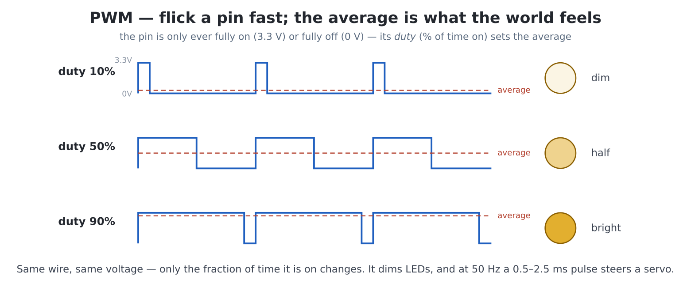

# Chapter 31 — Talking to the outside world: GPIO

Everything so far happened behind glass. This chapter reaches through
it: the **I/O header** and the **QWIIC socket** are the machine's
hands, and with a breadboard and a fistful of parts your programs
start moving electrons in the room — lights, buttons, knobs, servos,
sensors. Part V closes where computing gets physical.

**The shopping list** (a "starter electronics kit" contains most of
it): a breadboard, jumper wires (male-female for the header), a few
LEDs, 330 Ω resistors, a couple of push buttons, a 10 kΩ
potentiometer, a **thermistor** (a resistor whose value changes with
temperature), and — for the grand finale — a small hobby servo. Total
cost: a pizza. A couple of the later experiments also use a plug-in
**QWIIC light sensor** such as the TSL2591; the I2C section below
introduces it.

**The safety card**, read twice, taped to the desk:

- This chip speaks **3.3 volts**. The header's 5V pin is for
  *powering* things (like the servo) — it must never touch a GPIO.
- An LED without a resistor is a dead LED and a stressed pin —
  330 Ω, always, no exceptions.
- Never join 5V or 3.3V to GND, wire with the power off (the on/off
  switch is right there), and keep GP25 out of your plans entirely —
  it belongs to the wireless module.

## The header map

Fifteen pin-pairs, exactly as silk-screened beside the header (the
board photo in chapter 1 shows it):

```
GP21  GND        <- I2C0 SCL (shared with the QWIIC socket + DS3231)
GP20  +5V        <- I2C0 SDA (shared, 10K pull-ups on board)
GP45  GP46       \
GP43  GP44        |  GP40-GP46: also ANALOGUE inputs (machine.ADC)
GP41  GP42        |
GP39  GP40       /
GP37  GP38
GP35  GP36
GP26  GP34
GP07  GP06
GP05  GP04
GP03  GP02
GP01  GP00
VCC   VCC        <- 3.3 V out
GND   GND
```

Every GP pin here is yours for `Pin`, and any of them can do PWM. The
special talents: **GP40–GP46** are this chip's analogue-capable pins
(`machine.ADC`); **GP20/GP21** are the I2C bus — shared with the
QWIIC socket *and* the on-board DS3231, so treat them as the I2C bus
they are, never as plain pins. (GP32 and GP27 carry the DS3231's
alarm and 32 kHz outputs — chapter 28 met the first.) The manual's
section 2 lists the machine's own reserved pins; the header simply
never exposes them.


## Output: your first electron

Wire an LED: **GP0 → resistor → LED long leg, LED short leg → GND.**
Then `edit("blink2.py")`:

```python
import time

led = Pin(0, Pin.OUT)

for _ in range(20):
    led.toggle()
    time.sleep(0.25)
led.off()
```

Chapter 2's blink, except *you built the light*. `Pin(n, Pin.OUT)`
claims a pin as an output; `.on()`, `.off()`, `.toggle()`, or
`.value(1)` command it. That's the entire API for everything that
switches: LEDs today, relays, transistors and motor drivers the day
you need them.

## Input: buttons, and why pins float

Wire a button between **GP1 and GND**. Then `edit("pressme.py")`:

```python
import time

button = Pin(1, Pin.IN, Pin.PULL_UP)

print("press the button (Ctrl-C to stop)")
was = 1
while True:
    now = button.value()
    if now == 0 and was == 1:          # just pressed (ch 25, in copper)
        beep()
        print("click!")
    was = now
    time.sleep_ms(5)
```

Two things demand understanding. **`PULL_UP`**: an unconnected input
pin is *floating* — it reads whatever nearby electric fields whisper
(experiment 1 makes this spooky truth visible). The pull-up is a weak
internal resistor holding the pin at 1 until the button *pulls* it to
GND — so **pressed reads 0**, idle reads 1, and nothing ever floats.
It's counter-intuitive for a day and second nature forever. And the
`now`/`was` pair is chapter 25's just-pressed pattern, now debouncing
real springy metal — the 5 ms nap conveniently outlasts most contact
rattle.


> **Coming from MMBasic:** `SETPIN n, DOUT` / `DIN` / `AIN` / `PWM`
> map to `Pin(n, Pin.OUT)`, `Pin(n, Pin.IN, ...)`, `machine.ADC`,
> `machine.PWM` — and the pull-up option you always added on DIN is
> the `Pin.PULL_UP` argument.

## Analogue: the knob

Digital pins know two words; the ADC hears the whole range. Wire the
potentiometer: outer legs to **3.3V (VCC)** and **GND**, wiper to
**GP40**. `edit("knob.py")`:

```python
import time
import machine

knob = machine.ADC(Pin(40))

for _ in range(200):
    raw = knob.read_u16()              # 0 .. 65535
    percent = raw * 100 // 65535
    print(f"\r{'#' * (percent // 5):20} {percent:3}%", end="")
    time.sleep_ms(50)
print()
```

`read_u16()` returns 0–65535 across 0–3.3 V; everything else is
scaling. Turn the knob and watch the bar chase your fingers — that's
a *voltage divider* you built (the wiper taps a fraction of 3.3 V),
and the same trick reads any resistive sensor: swap the pot for a
**thermistor and a 10 kΩ fixed resistor** in series (3.3V →
thermistor → GP40 → resistor → GND) and the bar now tracks
temperature — pinch the thermistor and watch it climb with your body
heat. One circuit, a thousand sensors.

## PWM: pretending, very fast

A pin that flicks on and off thousands of times a second *averages*
to something in between — that's PWM, and it dims LEDs and, more
gloriously, commands servos.

 Wire the servo: brown→GND, red→**5V**,
orange (signal)→**GP2**. `edit("sweep.py")`:

```python
import time
import machine

servo = machine.PWM(Pin(2), freq=50)     # servos want 50 Hz

def angle(deg):
    # 0 deg = 0.5 ms pulse, 180 deg = 2.5 ms, out of a 20 ms frame
    us = 500 + deg * 2000 // 180
    servo.duty_u16(us * 65535 // 20000)

for _ in range(3):
    for a in range(0, 181, 5):
        angle(a)
        time.sleep_ms(20)
    for a in range(180, -1, -5):
        angle(a)
        time.sleep_ms(20)
servo.duty_u16(0)                        # release (stops the hold jitter)
```

A thing in the room *moves* because your `for` loop said so — for
most people the single most startling moment in this book. The
`angle()` maths is the servo convention (a 0.5–2.5 ms pulse every
20 ms encodes the angle); `duty_u16` sets the pulse as a fraction of
65535. For LED dimming, same API: `machine.PWM(Pin(0), freq=1000)`
and `duty_u16(anything)` — wire experiment 3's night-light and see.

## I2C and the QWIIC socket: the module ecosystem

Beyond home-made circuits lies an industry of **plug-together
modules** — SparkFun Qwiic, Adafruit STEMMA QT, Pimoroni Qw/ST:
hundreds of sensors and gadgets on one four-wire standard, and this
board's QWIIC socket speaks it with no soldering at all. They all
ride the **I2C bus** (GP20/21), where every device has an address.
Meet the bus — `edit("roll_call.py")`:

```python
import machine

i2c = machine.I2C(0, sda=Pin(20), scl=Pin(21), freq=400000)
found = i2c.scan()
print("devices answering:", [hex(a) for a in found])
```

Run it bare and one voice answers: `0x68` — the DS3231, this book's
oldest resident, revealed as just another I2C citizen. Plug a QWIIC
module into the socket, run again, and its address joins the roll
call: plug in the **TSL2591 ambient-light sensor**, for instance, and
`0x29` appears. From there, each module has a MicroPython driver —
usually one `mip.install(...)` away (the `mip` package tool came
aboard in chapter 29) or a short datasheet read; the pattern is always
`readfrom_mem`/`writeto_mem` at its address, exactly as `ds3231.py`
does — and that file, now, is readable to you as a *worked example*.
For the TSL2591 its driver turns the raw sensor into a plain **lux**
reading (how bright the room is, in real units) — the light
experiments below build on it.

(The header also carries everything `machine.UART` and `machine.SPI`
need, for modules that speak those instead — the MicroPython docs
cover them in the manual's section-16 spirit: standard APIs, nothing
board-specific.)

## Project: the paddle controller

In 1976, Breakout shipped with a *knob*, not buttons — and your
chapter 23 Breakout deserves one, plus a proper arcade fire button.
Build the controller: the potentiometer's wiper on **GP40** (outer
legs 3.3V/GND), a button from **GP1 to GND**. Then the driver —
`edit("gpad.py")`:

```python
# gpad.py -- a knob-and-button game controller on the I/O header.
#   import gpad
#   x = gpad.dial(0, 559)     # knob position, scaled to a range
#   if gpad.fire(): ...       # edge-detected button press
import machine

_knob = machine.ADC(Pin(40))
_button = Pin(1, Pin.IN, Pin.PULL_UP)
_fire_was = 1

def raw():
    """The knob, 0..65535 (noisy at the edges -- that's analogue life)."""
    return _knob.read_u16()

def dial(lo, hi):
    """The knob mapped onto lo..hi."""
    return lo + raw() * (hi - lo) // 65535

def held():
    """Is the button down right now?"""
    return _button.value() == 0

def fire():
    """True exactly once per press (the just-pressed pattern)."""
    global _fire_was
    now = _button.value()
    pressed = now == 0 and _fire_was == 1
    _fire_was = now
    return pressed

if __name__ == "__main__":
    import time
    print("controller test -- turn and click (Ctrl-C stops)")
    while True:
        bar = dial(0, 20)
        click = " CLICK!" if fire() else ""
        print(f"\r{'#' * bar:20}{click}   ", end="")
        time.sleep_ms(20)
```

Run its self-test, then perform the transplant on `breakout.py`.
Add `import gpad` at the top, and replace the paddle's input lines —

```python
            if held(keyboard.LEFT):
                px -= 420 * dt
            if held(keyboard.RIGHT):
                px += 420 * dt
            px = max(0, min(W - PW, px))
```

— with one:

```python
            px = gpad.dial(0, W - PW)
```

(and let SPACE *or* `gpad.fire()` start the game, if you like the
button). This is the fragment exception again, chapter 19 style — a
patch to a program you own. Play it. **Absolute paddle position** —
the knob's angle *is* the paddle's place, no speed limit, no travel
time — is a control feel keyboards cannot produce, and it is why the
1976 cabinet had a knob. Your hands will report the difference inside
ten seconds; a second player will refuse to give the controller back.

## Experiments

1. The floating pin, witnessed: `Pin(3, Pin.IN)` — no pull-up, nothing
   wired — and print `.value()` in a loop while you wave your hand
   *near* (not touching) the header. Spooky, and exactly why
   `PULL_UP` exists. Now add the pull-up and watch certainty return.
2. The theremin: knob to `tone()` — `tone(gpad.dial(200, 2000))` in a
   loop, `stop()` on the button. Chapter 20 meets copper; expect
   family members to appear and demand a turn.
3. The night-light: the TSL2591's **lux** reading (I2C, from the roll
   call above) driving an LED on PWM (GP0) — darker room, brighter LED
   (invert the scale). Then add **hysteresis**: switch the LED on below
   one lux level and off above a higher one — and discover why, without
   that gap, dusk makes the light *flicker* at the threshold (the sensor
   answers, the LED changes the light, the sensor answers...). A
   control-systems lesson in a bedside gadget.
4. Servo clock: chapter 28's `gettime()` driving `angle()` — seconds
   sweep 0–180°. A clock with a *hand*, in the physical sense.
5. Re-run the roll call with your QWIIC module plugged in, then
   unplugged mid-scan (safe — I2C tolerates it). The DS3231 never
   leaves; note your module's address for its driver.

## Challenges

1. **The reaction duel, physical.** Chapter 21's duel with two real
   arcade buttons (GP1, GP4) on long wires — the players can finally
   sit apart, and false starts get a physical *thunk*. Compare
   measured reaction times: buttons vs keyboard keys (there *is* a
   difference; measure it, don't assume it).
2. **The gallery cabinet.** Chapter 18's shooting gallery on the
   controller: knob aims the crosshair's x, button fires, and a second
   knob (GP41) aims y if you have one. Cardboard cabinet optional but
   traditional.
3. **The plant sentinel.** The TSL2591's light level logged hourly to
   CSV (chapter 28's cron-junior), plotted daily (chapter 30), with
   your thermistor's temperature — or a QWIIC soil-moisture module —
   joining the log. Weeks later: your windowsill, as data.
4. **The closed loop.** Chapter 30's `pcmath.PID` in the flesh: an LED
   (PWM) pointing at the TSL2591, and the controller holding the sensor
   at a *setpoint* light level — cover the sensor with your hand and
   watch the LED fight back within a frame. That's a control loop, the
   idea inside thermostats, drones and rockets, running on your desk.
